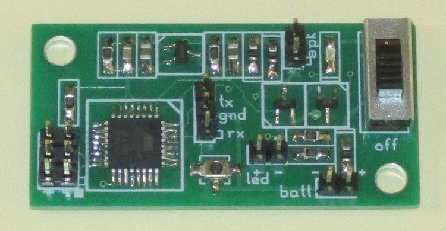
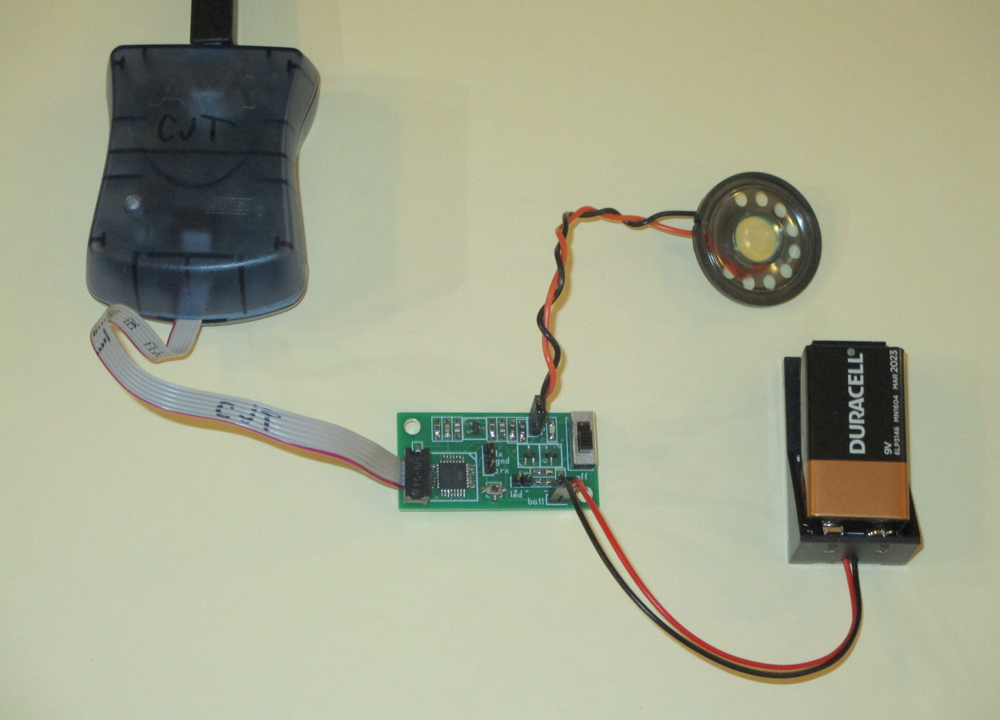
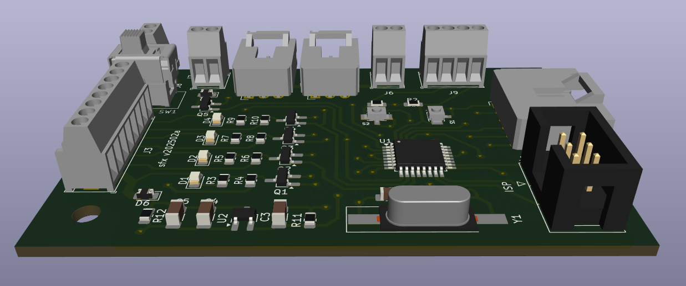
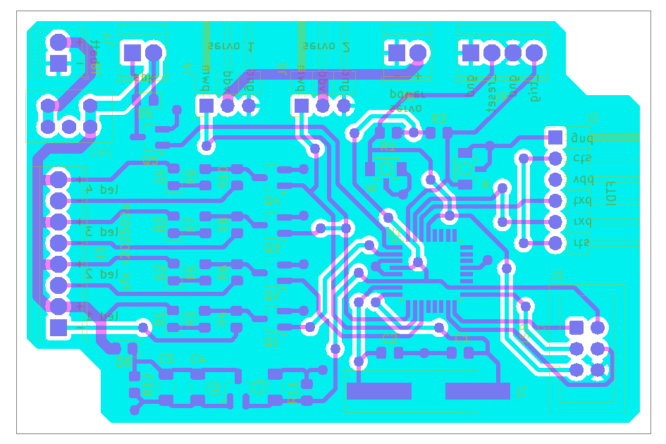
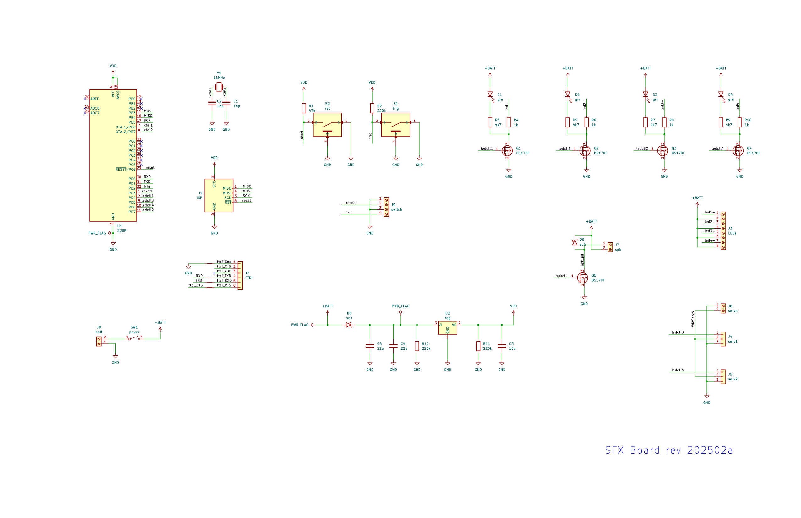

# Chris's Special-Effects Boards

## Overview

These are a series of hobby-project boards intended to produce sounds and
blinking lights. The boards are Arduino-compatible and small enough to be
packaged inside homemade toys.

Except where indicated otherwise, the files in this project are copyright (c)
2025 by Christopher Thomas and are released under the Creative Commons
Attribution-ShareAlike 4.0 International License.

**FIXME** - This really needs a user manual.
**FIXME** - Firmware code not yet folded into the repository.

## KiCAD Configuration

In `Preferences`->`Configure Paths`, set `KICAD_EXT_VENDOR` to point to the
`vendor-kicad` folder.

## Folders

* `pcb-202009-9v` -- Compact board that sits beside a 9v battery.
Needs an external clock to be programmed. Made with the "`pcb`" program
(now part of `gEDA`) rather than with KiCAD.
* `pcb-202502` -- Feature-rich board with terminal block connections. Bulky
and very expensive. Made with KiCAD.
* `vendor-datasheets` -- Datasheets. Under vendor copyright.
* `vendor-kicad` -- Vendor-supplied KiCAD files, with additions and
modifications where appropriate. Under vendor copyright.
* `vendor-models` -- Vendor-supplied geometry models. Under vendor copyright.

## Gallery

*This is the end of the file.*
